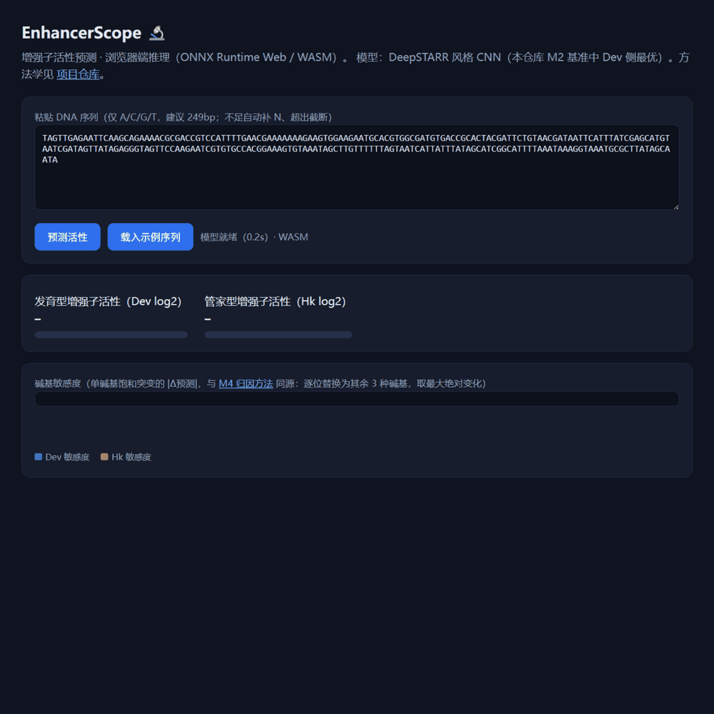

# EnhancerScope 🔬

**用基因组语言模型预测增强子活性：从防泄漏基准到浏览器工具与 MCP 插件**

[](https://github.com/fzyz-whx/EnhancerScope/actions/workflows/ci.yml)
[](https://github.com/fzyz-whx/EnhancerScope/actions/workflows/pages.yml)
[](LICENSE)

> 在果蝇 S2 细胞 STARR-seq 增强子活性数据（48.4 万条 249bp 序列）上，系统对比
> k-mer+GBDT / CNN / 基因组语言模型零样本 / LoRA 微调四类方法；**只微调 0.50% 参数的 DNABERT-2
> 在 Hk 任务上超过从零训练的全量 CNN**；并把模型做成浏览器可用的交互工具与 LLM agent 的 MCP 插件。

**[→ 打开在线演示](https://fzyz-whx.github.io/EnhancerScope/)** ｜ [数据卡](docs/datacard.md) ｜ [实验记录](docs/experiments.md) ｜ [可解释性](docs/interpretability.md) ｜ [决策记录](docs/decisions.md) ｜ [面试问答](docs/interview-qa.md)

---

## English TL;DR

**EnhancerScope** benchmarks genomic language models on Drosophila S2 STARR-seq enhancer activity
(484k × 249bp, continuous log2 enrichment). We compare k-mer+LightGBM, a DeepSTARR-style CNN,
zero-shot DNABERT-2 embeddings, and **LoRA fine-tuning of DNABERT-2 (0.50% trainable params)** under a
**leak-proof chromosome-level split** (whole chr2R held out; valid/test coordinates provably disjoint).
LoRA reaches Spearman ρ **0.6214/0.5722** (Dev/Hk) and beats the from-scratch CNN on Hk, while raising
DNABERT-2's own zero-shot baseline by **+0.19 / +0.21**. A HyenaDNA fine-tune is reported honestly as a
negative result with attributed causes. The best CNN is exported to ONNX (numerically verified,
max|Δ|<1e-6) and shipped as a **browser demo** (WASM, 2–15 ms per sequence) and a **FastMCP tool layer**
(`predict_activity` / `explain_sequence` / `batch_scan`). Every number is reproducible from
`results/` via fixed-seed scripts.

---

## 核心结论（先看这三条）

1. **微调的价值被量化**：同一个 DNABERT-2，零样本 0.428/0.363 → LoRA 微调 **0.6214 ± 0.0088 / 0.5722 ± 0.0044**（Dev/Hk, test Spearman）。
2. **预训练的价值被量化**：只微调 **0.50% 参数**（589,824/117.7M）、显存峰值 2.67GB，在 Hk 上**超过**从零训练的全量 CNN（0.5722 > 0.566），Dev 仅差 0.018。
3. **负结果也如实报告**：HyenaDNA（3.3M）LoRA 失败（0.2845/0.2486），四条归因假设写在实验记录里，未美化、未隐藏。

## 架构

```
                        数据层（防泄漏是硬约束）
  ┌────────────────────────────────────────────────────────────────┐
  │  GenerTeam/DeepSTARR ← 官方 Zenodo 5502060                     │
  │  484,034 × 249bp，连续活性（Dev 发育型 / Hk 管家型）             │
  │  清洗：过滤 18 条含 N 序列（异染色质臂）→ 确定性规则              │
  │  划分：train 11 条臂 | valid = chr2R 左半 | test = chr2R 右半     │
  │        verify_split.py 断言：id 零交集 / 染色体零重叠 / 坐标零重叠 │
  └────────────────────────────────────────────────────────────────┘
                              │
                   ┌──────────┴───────────┐
                   ▼                      ▼
          科研内核（M2/M3/M4）      交付层（M5/M6）
  ┌───────────────────────────┐  ┌──────────────────────────────────┐
  │ ① k-mer(6)+GC → LightGBM  │  │ 浏览器 demo（GitHub Pages）       │
  │ ② DeepSTARR 风格 CNN ──┐  │  │  · ONNX Runtime Web (WASM)       │
  │ ③ DNABERT-2 零样本      │  │  │  · 粘贴 DNA → Dev/Hk + 碱基高亮   │
  │ ④ LoRA DNABERT-2 (r=16)│  │  │  · 实测 2–15 ms/序列             │
  │ ⑤ LoRA HyenaDNA（负结果）│  │  ├──────────────────────────────────┤
  │                        │  │  │ MCP 工具层（FastMCP, stdio）      │
  │ 可解释性：              │  │  │  · predict_activity              │
  │  单碱基突变 + 窗口遮蔽   ├──┼─▶│  · explain_sequence              │
  │  + JASPAR motif 对照    │  │  │  · batch_scan                    │
  └────────────────────────┘  │  └──────────────────────────────────┘
                              └─ ONNX 导出（一致性闸门 max|Δ|<1e-6）
```

## Benchmark（test split，Spearman ρ，越大越好）

| 模型 | Dev（发育型） | Hk（管家型） | 说明 |
|---|---|---|---|
| ① k-mer(k=6)+GC → LightGBM | 0.581 | 0.519 | 单种子 42；词袋无位置信息 |
| ② DeepSTARR 风格 CNN | **0.639 ± 0.003** | 0.566 ± 0.005 | 从零训练，3 种子 |
| ③ DNABERT-2 零样本（embed+Ridge，不微调） | 0.428 | 0.363 | 探针 train 抽样 5 万 |
| ④ **LoRA 微调 DNABERT-2** | 0.6214 ± 0.0088 | **0.5722 ± 0.0044** | 微调 0.50% 参数，47 min/run，显存 2.67GB |
| ⑤ LoRA 微调 HyenaDNA | 0.2845 ± 0.0021 | 0.2486 ± 0.0008 | **负结果**，归因见 [experiments.md §4.1](docs/experiments.md) |

> 与官方 DeepSTARR 论文（test Pearson ≈0.93）仍有差距：早停急 + 超参未完全复现。
> 本项目定位是**透明可复现的对比基准**，不是 SOTA 复现——差距写在 README 里而不是藏起来。

## 在线演示



浏览器端真实实测（ONNX Runtime Web / WASM）：

| 指标 | 实测值 |
|---|---|
| 模型加载 | 0.2–0.4 s（0.81MB ONNX，之后走 HTTP 缓存） |
| 单序列推理 | **2–15 ms**（目标 <3 s） |
| 逐碱基敏感度（747 条变体批量前向） | 511–572 ms |

页面加载的是 **CNN**（0.81MB）而非 LoRA DNABERT-2（481MB）——这个取舍与两个模型的 ONNX
数值一致性证据见 [webapp/README](webapp/README.md) 与 `results/onnx_parity.json`。

## 快速开始

```bash
# 1) 环境（本地含 ML 栈；CI 只装默认组，故 ML 依赖单独分组）
uv sync --all-groups

# 2) 环境自检
uv run enhancerscope-demo

# 3) 数据：清洗 → 防泄漏验证（原始 parquet 的获取方式见数据卡）
uv run python scripts/clean_data.py
uv run python scripts/verify_split.py    # 断言：id 零交集 / 染色体零重叠 / 249bp / 仅 ACGT

# 4) 复现基准（seed 固定：42/43/44）
uv run --group ml python scripts/baseline_kmer_gbm.py
uv run --group ml python scripts/baseline_cnn.py
uv run --group ml python scripts/baseline_zeroshot.py

# 5) 权重不入库：先下载再微调
uv run --group ml python scripts/download_model.py     # DNABERT-2 468MB（断点续传）
uv run --group ml python scripts/finetune_lora.py --model dnabert2 --seed 42 --epochs 3

# 6) 可解释性案例（突变扫描 + JASPAR motif 对照）
uv run --group ml python scripts/interpret_case_studies.py

# 7) 浏览器 demo / MCP server
cd webapp && npm install && npm run build && npm run preview
uv run enhancerscope-mcp                               # MCP（stdio）
```

## MCP 工具层（给 LLM agent 用）

```json
{
  "mcpServers": {
    "enhancerscope": {
      "command": "uv",
      "args": ["run", "--project", "/path/to/EnhancerScope", "enhancerscope-mcp"]
    }
  }
}
```

| 工具 | 入参 | 返回 |
|---|---|---|
| `predict_activity` | `sequence`（<249 补 N、>249 截断并标注） | Dev/Hk 活性（log2 富集） |
| `explain_sequence` | `sequence`, `top_k=10` | 影响最大的位点（单碱基饱和突变，与 M4 归因同源） |
| `batch_scan` | `fasta`（FASTA 文本或文件路径）, `top_k=3` | 逐条预测 + 排名 + 判定 |

验证：`uv run python scripts/mcp_stdio_check.py`（协议层握手冒烟）；
agent 调用演示记录：[docs/assets/mcp_demo.txt](docs/assets/mcp_demo.txt)。

## 项目结构

```
src/enhancerscope/   data(加载) · features(k-mer) · metrics · model(推理入口)
                     motifs(PWM 扫描) · explain(归因) · mcp_server
scripts/             清洗/划分验证 · 三条 baseline · LoRA 微调 · 可解释性
                     ONNX 导出(含一致性闸门) · 下载脚本 · MCP 冒烟与演示
configs/             baselines.json · lora.json（超参与选择理由）
docs/                datacard · experiments · interpretability · decisions · interview-qa · devlog
webapp/              Vite + TS 前端（WASM 推理 + 碱基敏感度高亮）
results/             baseline.csv · lora.csv(+summary) · interpretability/*.json · figures/
tests/               34 个单测（含 MCP 工具与 schema 断言），CI 全绿
```

## 数据与模型引用

- **数据**：de Almeida, Reiter, Pagani, Stark. *DeepSTARR predicts enhancer activity from DNA sequence
  and enables the de novo design of synthetic enhancers.* **Nature Genetics** 44, 613–624 (2022)。
  取自官方 [Zenodo 5502060](https://zenodo.org/records/5502060)，经 HuggingFace
  `GenerTeam/DeepSTARR-enhancer-activity`（仅格式调整）镜像下载。
- **模型**：Zhou et al. *DNABERT-2: Efficient Foundation Model and Benchmark for Multi-Species Genomes.*
  **ICLR 2024**；Nguyen et al. *HyenaDNA: Long-Range Genomic Sequence Modeling at Single Nucleotide
  Resolution.* **NeurIPS 2023**。
- **motif 库**：Fornes et al. *JASPAR 2020.* **NAR** 48:D87 (2020)（insects CORE + UNVALIDATED，
  经 `vanheeringen-lab/gimmemotifs` 获取，溯源见 `scripts/download_jaspar.py`）。
- **方法**：Hu et al. *LoRA: Low-Rank Adaptation of Large Language Models.* **ICLR 2022**。

## FAQ

- **HuggingFace 下不动？** 统一走镜像：`export HF_ENDPOINT=https://hf-mirror.com`；权重用
  `scripts/download_model.py`（curl `-C -` 断点续传 + 重试）下载到 `data/models/`（不入库）。
- **`uv sync` 后没有 torch？** ML 栈在 `ml` 分组：用 `uv sync --all-groups`（CI 只装默认组以保持轻量）。
- **想重新导出 ONNX？** `uv run --group ml python scripts/export_onnx.py --quantize`（含一致性闸门，
  不通过返回非 0）；浏览器用的是 `scripts/export_cnn_onnx.py` 产出的 0.81MB 模型。
- **为什么仓库里没有数据集和权重？** 单文件 >10MB 一律不入库，全部由下载脚本 + 数据卡管理，
  `data/` 已在 `.gitignore`。

## 路线图（全部完成）

- [x] **M0** 仓库奠基：uv + pre-commit + CI + 首个 PR
- [x] **M1** 数据勘察与数据卡：EDA + 染色体级防泄漏划分（断言 + sha256 清单）
- [x] **M2** Baseline 三件套：k-mer+GBDT / CNN / 零样本
- [x] **M3** 主实验：LoRA 微调 DNABERT-2 与 HyenaDNA（3 种子，含负结果归因）
- [x] **M4** 可解释性：突变扫描 + 窗口遮蔽 + JASPAR 对照（3 案例，含失败案例）
- [x] **M5** 浏览器交互层：ONNX（一致性闸门）+ Vite/TS + GitHub Pages
- [x] **M6** MCP 工具层：FastMCP 三工具 + 协议层冒烟 + agent 演示
- [x] **M7** 发布打磨：数据卡/实验/可解释性/决策/面试问答 + Release

## License

MIT（见 [LICENSE](LICENSE)）。本项目为课程项目；数据与预训练权重版权归原作者所有。
